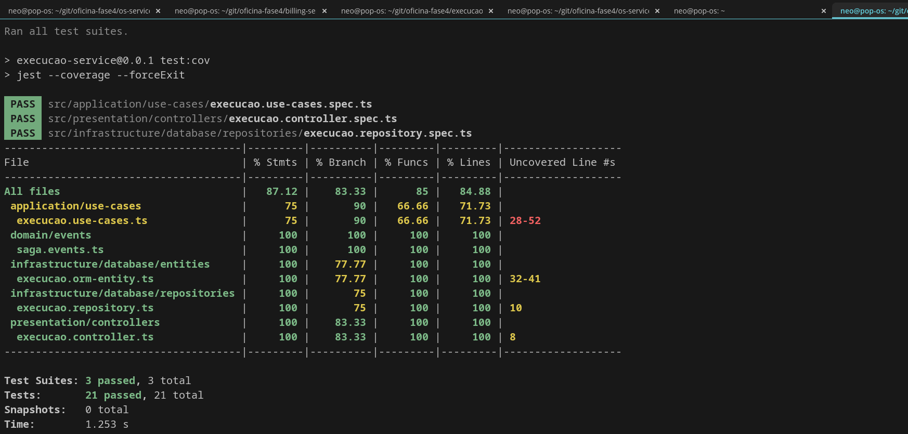

# Execucao Service — Oficina Mecânica Fase 4

Microsservico responsavel pela fila de execucao e producao dos reparos.

## Stack
- Node.js 20 + NestJS + TypeScript
- PostgreSQL (banco relacional)
- RabbitMQ (mensageria assincrona)

## Responsabilidades no Saga

    os.aprovada  -> entrar na fila de execucao
                 -> EM_DIAGNOSTICO (automatico)
                 -> EM_REPARO (automatico)
                 -> FINALIZADA -> publica execucao.finalizada
    os.cancelada -> cancelar execucao (compensacao)

## Endpoints

| Metodo | Rota | Descricao |
|---|---|---|
| GET | /api/v1/execucoes | Listar execucoes |
| GET | /api/v1/execucoes/health | Health check |
| GET | /api/v1/execucoes/:osId | Buscar por OS |
| POST | /api/v1/execucoes/:osId/finalizar | Finalizar manualmente |

Swagger: http://localhost:3003/api/docs

## Como rodar localmente

    cp .env.example .env
    docker compose up -d postgres-execucao
    npm install
    npm run start:dev

## Testes

    npm run test:cov

| Suite | Testes | Cobertura |
|---|---|---|
| Unitarios | 21 | 87% |

## Repositorios relacionados
- OS Service: https://github.com/Tiago-Machado/Tech-CH-oficina4-os-servic
- Billing Service: https://github.com/Tiago-Machado/Tech-CH-oficina4-billing-service

## Evidencia de Cobertura de Testes

### Execucao Service — 87.12% | 21 testes (3 suites)

